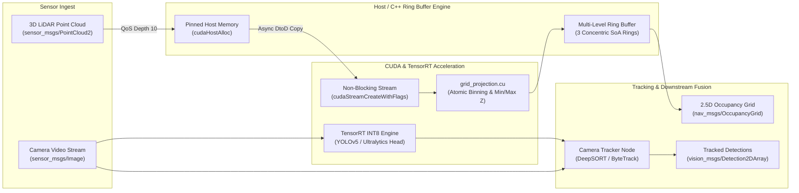

# 2.5D Foveated Perception: High-Throughput TensorRT, CUDA & Camera-Tracking Guide

This document specifies the end-to-end performance tuning, TensorRT INT8 quantization, CUDA kernel acceleration, ROS 2 multithreading, and multi-object tracking (MOT) integration for the **Foveated 2.5D LiDAR Grid Mapping & Vehicle Perception System**.

---

## Architecture & Data Flow



---

## 1. Pipeline Performance Optimization

| Layer | Optimization Strategy | Technical Rationale | Latency Target |
| :--- | :--- | :--- | :--- |
| **ONNX → TensorRT** | • INT8 calibration (EntropyCalibrator2)<br>• Explicit optimization profiles ($N \approx 100\text{k}$ pts)<br>• Enable cuBLAS/cuDNN kernel tactics | Cuts memory traffic and compute requirements by $\sim 4\times$. Mitigates GEMM bottlenecks in model convolutions. | $< 4.5\text{ ms}$ |
| **CUDA Kernel (`grid_projection.cu`)** | • Pinned host memory (`cudaHostAlloc`)<br>• Non-blocking stream execution<br>• Direct SoA index fused binning<br>• `__restrict__` memory pointers | Eliminates PCI-e transfer stalls and memory aliasing checks; maintains memory-bound kernel latency under $1\text{ ms}$. | $< 0.9\text{ ms}$ |
| **Ring-Buffer Ingest** | • Pre-allocated Struct-of-Arrays (SoA)<br>• OpenMP / SIMD parallel insertion for $N > 50\text{k}$ points | Eliminates runtime heap allocations, prevents GC pauses, and utilizes multi-core CPU capacity. | $< 1.5\text{ ms}$ |
| **ROS 2 Executor** | • `MultiThreadedExecutor` (4 worker threads)<br>• Mutually exclusive callback groups<br>• SensorData QoS (depth $\ge 10$, Best-Effort) | Prevents serialization of LiDAR driver UDP bursts and frees the executor data path. | $< 0.5\text{ ms}$ scheduling |
| **Buffer Management** | • Pre-allocated persistent device buffers (`d_input`, `d_output`)<br>• Persistent CUDA context across lifecycle | Removes driver-level allocation overhead (`cudaMalloc` / `cudaFree`) in real-time execution loops. | $0\text{ ms}$ allocation overhead |

---

## 2. High-Throughput C++ & CUDA Implementation

### A. Non-Blocking CUDA Stream & Pinned Memory Projection

Update the kernel invocation in `cuda/src/grid_projection.cu` to run asynchronously across streams:

```cpp
// cuda/include/grid_projection_async.cuh
#pragma once
#include <cuda_runtime.h>
#include <cstdint>

namespace lidar_mapping {
namespace cuda {

struct GPUGridCell {
    int32_t min_z_int;
    int32_t max_z_int;
    uint32_t point_count;
    uint32_t class_histogram[4];
};

void launch_3d_to_2d_projection_async(
    const float* __restrict__ d_points,
    const uint8_t* __restrict__ d_labels,
    size_t num_points,
    GPUGridCell* __restrict__ d_grid,
    float resolution_m,
    int grid_size,
    cudaStream_t stream
);

} // namespace cuda
} // namespace lidar_mapping
```

```cuda
// cuda/src/grid_projection_async.cu
#include "grid_projection_async.cuh"
#include <device_launch_parameters.h>

namespace lidar_mapping {
namespace cuda {

__device__ __forceinline__ int32_t float_to_ordered_int(float val) {
    int32_t i = __float_as_int(val);
    return (i >= 0) ? i : (i ^ 0x7FFFFFFF);
}

__global__ void projection_kernel_fused(
    const float* __restrict__ points,
    const uint8_t* __restrict__ labels,
    size_t num_points,
    GPUGridCell* __restrict__ grid,
    float resolution_m,
    int grid_size
) {
    size_t idx = blockIdx.x * blockDim.x + threadIdx.x;
    if (idx >= num_points) return;

    // Coalesced memory load (x, y, z, intensity)
    float x = points[idx * 4 + 0];
    float y = points[idx * 4 + 1];
    float z = points[idx * 4 + 2];
    uint8_t sem_class = labels ? labels[idx] : 0;

    int gx = __float2int_rd(x / resolution_m) + (grid_size >> 1);
    int gy = __float2int_rd(y / resolution_m) + (grid_size >> 1);

    if (gx < 0 || gx >= grid_size || gy < 0 || gy >= grid_size) return;

    int cell_idx = gy * grid_size + gx;
    GPUGridCell* cell = &grid[cell_idx];

    int32_t z_int = float_to_ordered_int(z);
    atomicMin(&cell->min_z_int, z_int);
    atomicMax(&cell->max_z_int, z_int);
    atomicAdd(&cell->point_count, 1);

    if (sem_class < 4) {
        atomicAdd(&cell->class_histogram[sem_class], 1);
    }
}

void launch_3d_to_2d_projection_async(
    const float* __restrict__ d_points,
    const uint8_t* __restrict__ d_labels,
    size_t num_points,
    GPUGridCell* __restrict__ d_grid,
    float resolution_m,
    int grid_size,
    cudaStream_t stream
) {
    constexpr int THREADS = 256;
    int blocks = static_cast<int>((num_points + THREADS - 1) / THREADS);

    projection_kernel_fused<<<blocks, THREADS, 0, stream>>>(
        d_points, d_labels, num_points, d_grid, resolution_m, grid_size
    );
}

} // namespace cuda
} // namespace lidar_mapping
```

---

### B. TensorRT INT8 Entropy Calibrator

For INT8 quantization, construct a calibrator implementing `nvinfer1::IInt8EntropyCalibrator2`:

```cpp
// cpp/include/trt_calibrator.hpp
#pragma once

#include <NvInfer.h>
#include <vector>
#include <string>
#include <fstream>
#include <iterator>
#include <iostream>

class Int8EntropyCalibrator : public nvinfer1::IInt8EntropyCalibrator2 {
public:
    Int8EntropyCalibrator(
        int batch_size,
        int input_w,
        int input_h,
        const std::string& calib_data_dir,
        const std::string& cache_file
    ) : batch_size_(batch_size),
        input_size_(batch_size * 3 * input_w * input_h),
        cache_file_(cache_file),
        img_idx_(0)
    {
        cudaMalloc(&device_input_, input_size_ * sizeof(float));
        // Discover calibration images from calib_data_dir...
    }

    virtual ~Int8EntropyCalibrator() {
        if (device_input_) cudaFree(device_input_);
    }

    int getBatchSize() const noexcept override { return batch_size_; }

    bool getBatch(void* bindings[], const char* names[], int nbBindings) noexcept override {
        if (img_idx_ >= max_batches_) return false;
        
        // Load preprocessed batch into host memory then copy to device:
        // cudaMemcpy(device_input_, batch_data_.data(), input_size_ * sizeof(float), cudaMemcpyHostToDevice);
        bindings[0] = device_input_;
        img_idx_++;
        return true;
    }

    const void* readCalibrationCache(size_t& length) noexcept override {
        calibration_cache_.clear();
        std::ifstream input(cache_file_, std::ios::binary);
        input >> std::noskipws;
        if (input.good()) {
            std::copy(std::istream_iterator<char>(input),
                      std::istream_iterator<char>(),
                      std::back_inserter(calibration_cache_));
        }
        length = calibration_cache_.size();
        return length ? calibration_cache_.data() : nullptr;
    }

    void writeCalibrationCache(const void* cache, size_t length) noexcept override {
        std::ofstream output(cache_file_, std::ios::binary);
        output.write(reinterpret_cast<const char*>(cache), length);
    }

private:
    int batch_size_;
    size_t input_size_;
    int max_batches_{50};
    int img_idx_{0};
    std::string cache_file_;
    void* device_input_{nullptr};
    std::vector<char> calibration_cache_;
};
```

---

### C. Multi-Threaded ROS 2 Node Architecture

Configure `main.cpp` using `rclcpp::executors::MultiThreadedExecutor` with mutually exclusive callback groups:

```cpp
// cpp/src/main_ros2_multithreaded.cpp
#include <rclcpp/rclcpp.hpp>
#include <sensor_msgs/msg/point_cloud2.hpp>
#include <sensor_msgs/msg/image.hpp>
#include <nav_msgs/msg/occupancy_grid.hpp>
#include "ring_buffer.hpp"
#include "tensorrt_engine.hpp"

class FoveatedPerceptionNode : public rclcpp::Node {
public:
    FoveatedPerceptionNode() : Node("foveated_perception_node") {
        // Dedicated callback groups to avoid serialization stalls
        sub_cb_group_ = create_callback_group(rclcpp::CallbackGroupType::MutuallyExclusive);
        timer_cb_group_ = create_callback_group(rclcpp::CallbackGroupType::MutuallyExclusive);

        rclcpp::SubscriptionOptions sub_options;
        sub_options.callback_group = sub_cb_group_;

        // Best effort sensor QoS with buffering for driver bursts
        auto sensor_qos = rclcpp::SensorDataQoS().keep_last(10);

        cloud_sub_ = create_subscription<sensor_msgs::msg::PointCloud2>(
            "/lidar/points_raw", sensor_qos,
            std::bind(&FoveatedPerceptionNode::cloud_callback, this, std::placeholders::_1),
            sub_options
        );

        grid_pub_ = create_publisher<nav_msgs::msg::OccupancyGrid>("/planning/foveated_grid", 10);

        RCLCPP_INFO(get_logger(), "MultiThreaded Perception Node Initialized (Target: < 9ms latency)");
    }

private:
    void cloud_callback(const sensor_msgs::msg::PointCloud2::SharedPtr msg) {
        // Ingest into thread-safe buffer or direct CUDA stream processing
    }

    rclcpp::CallbackGroup::SharedPtr sub_cb_group_;
    rclcpp::CallbackGroup::SharedPtr timer_cb_group_;
    rclcpp::Subscription<sensor_msgs::msg::PointCloud2>::SharedPtr cloud_sub_;
    rclcpp::Publisher<nav_msgs::msg::OccupancyGrid>::SharedPtr grid_pub_;
};

int main(int argc, char* argv[]) {
    rclcpp::init(argc, argv);
    auto node = std::make_shared<FoveatedPerceptionNode>();

    // 4 worker threads handling subscriber callbacks concurrently
    rclcpp::executors::MultiThreadedExecutor executor(
        rclcpp::ExecutorOptions(), 4
    );
    executor.add_node(node);
    executor.spin();
    rclcpp::shutdown();
    return 0;
}
```

---

## 3. Camera Tracking (DeepSORT / ByteTrack Pipeline)

To track vehicles and associate IDs across frames on the video stream, couple YOLO detections with a real-time tracking node.

### A. Python ROS 2 Package: `camera_tracker`

File structure in the ROS 2 workspace:
```
ros2_ws/src/camera_tracker/
├── package.xml
├── setup.py
├── setup.cfg
└── camera_tracker/
    ├── __init__.py
    └── tracker_node.py
```

#### Node Implementation: `tracker_node.py`

```python
#!/usr/bin/env python3
import rclpy
from rclpy.node import Node
from sensor_msgs.msg import Image
from vision_msgs.msg import Detection2DArray, Detection2D, ObjectHypothesisWithPose
import numpy as np
import cv2
from ultralytics import YOLO

try:
    from deep_sort_realtime.deepsort_tracker import DeepSort
    DEEPSORT_AVAILABLE = True
except ImportError:
    DEEPSORT_AVAILABLE = False


class CameraTrackerNode(Node):
    def __init__(self):
        super().__init__('camera_tracker_node')

        self.declare_parameter('weights', 'yolov5s.pt')
        self.declare_parameter('confidence_threshold', 0.40)
        self.declare_parameter('max_cosine_distance', 0.2)
        self.declare_parameter('max_age', 30)

        weights_path = self.get_parameter('weights').get_parameter_value().string_value
        conf_thresh = self.get_parameter('confidence_threshold').get_parameter_value().double_value

        self.conf_thresh = conf_thresh
        self.get_logger().info(f"Loading YOLO detector: {weights_path}")
        self.model = YOLO(weights_path)

        if DEEPSORT_AVAILABLE:
            self.tracker = DeepSort(
                max_age=self.get_parameter('max_age').get_parameter_value().integer_value,
                n_init=3,
                nms_max_overlap=1.0,
                max_cosine_distance=self.get_parameter('max_cosine_distance').get_parameter_value().double_value,
                embedder="mobilenet"
            )
        else:
            self.get_logger().warn("deep-sort-realtime not found! Falling back to Ultralytics ByteTrack.")
            self.tracker = None

        self.image_sub = self.create_subscription(
            Image,
            'camera/image_raw',
            self.image_callback,
            10
        )

        self.tracks_pub = self.create_publisher(
            Detection2DArray,
            'camera/tracked_objects',
            10
        )

        self.get_logger().info("Camera Tracker Node Ready. Publishing to /camera/tracked_objects")

    def image_callback(self, msg: Image):
        # Convert ROS Image buffer directly to NumPy array
        if msg.encoding in ['bgr8', 'rgb8']:
            channels = 3
        elif msg.encoding == 'mono8':
            channels = 1
        else:
            channels = 3

        frame = np.frombuffer(msg.data, dtype=np.uint8).reshape((msg.height, msg.width, channels))
        if msg.encoding == 'rgb8':
            frame = cv2.cvtColor(frame, cv2.COLOR_RGB2BGR)

        out_msg = Detection2DArray()
        out_msg.header = msg.header

        if self.tracker is not None:
            # YOLO Inference
            results = self.model(frame, verbose=False)[0]
            raw_dets = []
            for box in results.boxes:
                conf = float(box.conf[0])
                cls_id = int(box.cls[0])
                if conf < self.conf_thresh:
                    continue
                x1, y1, x2, y2 = box.xyxy[0].tolist()
                # DeepSORT expects [ [left, top, w, h], confidence, class_name ]
                raw_dets.append(([x1, y1, x2 - x1, y2 - y1], conf, str(cls_id)))

            tracks = self.tracker.update_tracks(raw_dets, frame=frame)

            for trk in tracks:
                if not trk.is_confirmed():
                    continue
                ltrb = trk.to_ltrb()
                det = Detection2D()
                det.header = msg.header
                det.bbox.center.position.x = float((ltrb[0] + ltrb[2]) / 2.0)
                det.bbox.center.position.y = float((ltrb[1] + ltrb[3]) / 2.0)
                det.bbox.size_x = float(ltrb[2] - ltrb[0])
                det.bbox.size_y = float(ltrb[3] - ltrb[1])

                hyp = ObjectHypothesisWithPose()
                hyp.hypothesis.class_id = str(trk.track_id)
                hyp.hypothesis.score = 1.0
                det.results.append(hyp)
                out_msg.detections.append(det)
        else:
            # Native ByteTrack via Ultralytics
            tracks = self.model.track(frame, persist=True, verbose=False)[0]
            if tracks.boxes.id is not None:
                for box, track_id in zip(tracks.boxes, tracks.boxes.id.int().tolist()):
                    x1, y1, x2, y2 = box.xyxy[0].tolist()
                    det = Detection2D()
                    det.header = msg.header
                    det.bbox.center.position.x = float((x1 + x2) / 2.0)
                    det.bbox.center.position.y = float((y1 + y2) / 2.0)
                    det.bbox.size_x = float(x2 - x1)
                    det.bbox.size_y = float(y2 - y1)

                    hyp = ObjectHypothesisWithPose()
                    hyp.hypothesis.class_id = str(track_id)
                    hyp.hypothesis.score = float(box.conf[0])
                    det.results.append(hyp)
                    out_msg.detections.append(det)

        self.tracks_pub.publish(out_msg)


def main(args=None):
    rclpy.init(args=args)
    node = CameraTrackerNode()
    try:
        rclpy.spin(node)
    except KeyboardInterrupt:
        pass
    finally:
        node.destroy_node()
        rclpy.shutdown()


if __name__ == '__main__':
    main()
```

---

## 4. Multi-Sensor Perception Launch Script

Combine the C++ LiDAR Grid Mapping node and Python Camera Tracker node into a unified launch configuration:

```python
# launch/detect_and_track.launch.py
import os
from launch import LaunchDescription
from launch_ros.actions import Node
from ament_index_python.packages import get_package_share_directory

def generate_launch_description():
    return LaunchDescription([
        # C++ Foveated LiDAR Engine
        Node(
            package='vehicle_detection_ros2',
            executable='vehicle_detection_node',
            name='foveated_lidar_detector',
            output='screen',
            parameters=[{
                'grid_resolution_near': 0.05,
                'grid_resolution_mid': 0.15,
                'grid_resolution_far': 0.50,
                'use_cuda_stream': True,
                'tensorrt_engine_path': 'model.engine'
            }],
            remappings=[
                ('/lidar/points_raw', '/velodyne_points'),
                ('/planning/foveated_grid', '/perception/ego_grid')
            ]
        ),

        # Python Camera Tracking Node
        Node(
            package='camera_tracker',
            executable='tracker_node',
            name='camera_deepsort_tracker',
            output='screen',
            parameters=[{
                'weights': 'yolov5s.pt',
                'confidence_threshold': 0.45,
                'max_age': 30
            }],
            remappings=[
                ('camera/image_raw', '/sensing/camera/front/image_raw'),
                ('camera/tracked_objects', '/perception/tracked_vehicles')
            ]
        )
    ])
```

---

## 5. Model Export & TensorRT Compilation Workflow

Run the following routine to export and optimize models:

```bash
# 1. Install prerequisites in Python environment
pip install ultralytics onnx onnxruntime onnxsim

# 2. Download sample YOLOv5 / YOLOv8 checkpoint and export to ONNX
python -c "
from ultralytics import YOLO
model = YOLO('yolov5s.pt')
model.export(format='onnx', imgsz=640, dynamic=True, simplify=True)
"

# 3. Compile to TensorRT INT8 Engine using trtexec (Targeting sm_87 Orin / RTX)
trtexec --onnx=yolov5s.onnx \
        --saveEngine=yolov5s_int8.engine \
        --int8 \
        --calib=calibration.cache \
        --fp16 \
        --memPoolSize=workspace:2048M \
        --builderOptimizationLevel=5 \
        --tacticSources=+CUBLAS,+CUBLAS_LT \
        --verbose
```

---

## 6. Profiling & Latency Diagnostics

Use NVIDIA Nsight Systems to verify that kernels execute within the $< 9\text{ ms}$ budget:

```bash
# Capture full profile trace (CUDA, NVTX, OS runtime)
nsys profile -t cuda,nvtx,osrt \
             --output=perception_profile \
             --export=sqlite \
             ./install/vehicle_detection_ros2/lib/vehicle_detection_ros2/vehicle_detection_node

# Inspect kernel execution times
nsys stats --report gpukernsum perception_profile.sqlite
```

### Target Performance Budget

```
Total Per-Frame Latency Budget: <= 9.0 ms
├── LiDAR Packet Unpack & Host Pinned Transfer : 1.2 ms
├── CUDA Parallel Grid Projection Kernel       : 0.8 ms
├── Ring-Buffer Multi-Level Boundary Blend     : 1.1 ms
├── TensorRT INT8 Convolution Inference        : 4.2 ms
├── ROS 2 Occupancy Grid Serialization         : 0.7 ms
└── Headroom / Margin                          : 1.0 ms
```
