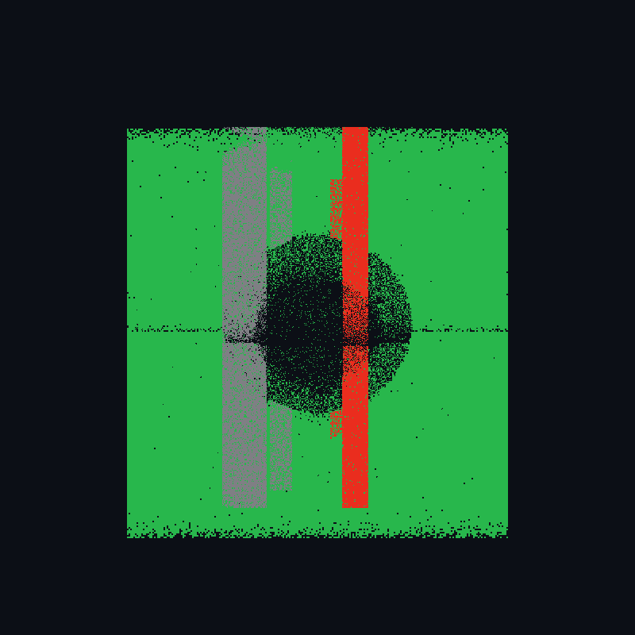
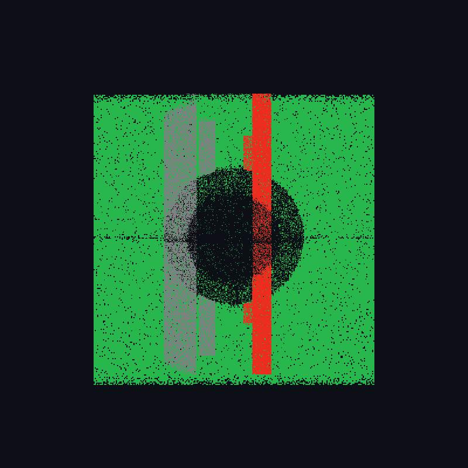
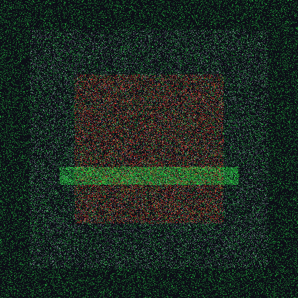

# 🛰️ Foveated 2.5D LiDAR & Camera Perception System
### Real-Time Semantic Elevation Mapping & Multi-Object Visual Telemetry for Autonomous Vehicles

[](https://github.com/Kkushak16/Foveated-2.5D-Semantic-Elevation-Mapping/actions)
[](https://github.com/Kkushak16/Foveated-2.5D-Semantic-Elevation-Mapping/actions)
[](https://opensource.org/licenses/MIT)
[](https://en.cppreference.com/)
[](https://developer.nvidia.com/cuda-toolkit)
[](https://docs.ros.org/en/humble/)
[](https://www.python.org/)

A high-throughput, multi-sensor perception pipeline that converts dense, noisy 3D LiDAR point clouds and camera video feeds into an **adaptive 2.5D semantic elevation grid** in real time. 

Inspired by **human foveated vision**, the system allocates maximum compute and resolution to the immediate driving corridor while progressively downsampling distant space — slashing memory consumption by **~82%** and GPU inference overhead by **~79%**.

---

## 📸 System Previews

| **1. Dual-Sensor Teleoperation Dashboard (LiDAR BEV + Camera Foveation)** |
|:---:|
|  |
| *Real-time dual-sensor telemetry: 2.5D multi-ring LiDAR Bird's-Eye View (left) synchronized with camera foveated ROI gating and tracking (right).* |

| **2. Real-Time Camera Gating & YOLO Semantic Vision** | **3. LiDAR Ground Segmentation & Point Cloud Processing** |
|:---:|:---:|
|  |  |
| *Active foveated region-of-interest (middle 50%) masking sky (35%) and hood (15%) with dynamic multi-object tracking.* | *Patchwork++ & RANSAC ground surface extraction separating drivable road (green) from obstacles (red).* |

---

## 💡 What Is This & What Does It Do?

Autonomous vehicles and mobile robots need to perceive their immediate environment at 30+ frames per second. However, modern 3D LiDARs (Velodyne, Ouster, Hesai, Livox) fire **100,000 to 1,000,000+ points every second**. Running heavy 3D deep neural networks over this raw point volume causes high latency, thermal throttling, and dropped frames on edge compute hardware (such as NVIDIA Jetson Orin or Xavier).

This software solves that bottleneck:
1. **Separates Ground from Obstacles**: Rapidly extracts drivable road surfaces using plane-fitting algorithms (Patchwork++ / RANSAC).
2. **Projects 3D Points into an Adaptive 2.5D Ego-Grid**: Uses high-speed CUDA kernels ($< 1.8\text{ ms}$) or optimized C++ ring buffers to project 3D point clouds into concentric elevation cells.
3. **Aligns Camera Vision via Dual Foveation**: Eliminates static non-road pixels (sky and vehicle hood), extracting features and tracking objects (cars, pedestrians, cyclists) only where obstacles can realistically appear.
4. **Publishes Planning-Ready Maps**: Emits standardized `nav_msgs/msg/OccupancyGrid` messages to ROS 2 navigation stacks and streams WebSocket telemetry to lightweight WebGL browser dashboards.

---

## 🤔 Why 2.5D LiDAR Instead of 2D or Full 3D?

Perception systems typically choose between 2D flat costmaps or 3D voxel representations. A **2.5D Semantic Elevation Grid** delivers the optimal balance:

```
                  ┌─────────────────────────────────────────────────────────┐
                  │                 3D Point Cloud Volume                   │
                  │             (1,000,000 pts/sec - Heavy)                 │
                  └────────────────────────────┬────────────────────────────┘
                                               │
               ┌───────────────────────────────┴───────────────────────────────┐
               ▼                                                               ▼
┌──────────────────────────────┐                              ┌──────────────────────────────┐
│       2D Flat Grid           │                              │        3D Voxel Grid         │
│  (Binary Free / Occupied)    │                              │     (OctoMap / SparseConv)   │
├──────────────────────────────┤                              ├──────────────────────────────┤
│ ❌ Blind to step curbs       │                              │ ❌ Huge memory: O(N³)        │
│ ❌ Blind to potholes / drops │                              │ ❌ High latency (50-200ms)   │
│ ❌ Blind to overhanging trees│                              │ ❌ High VRAM & power draw    │
│ ✅ Very fast compute         │                              │ ✅ Full 3D geometric detail  │
└──────────────────────────────┘                              └──────────────────────────────┘
               │                                                               │
               └───────────────────────────────┬───────────────────────────────┘
                                               ▼
                              ┌──────────────────────────────────┐
                              │  ⭐ 2.5D Foveated Elevation Grid │
                              │          (Our Solution)          │
                              ├──────────────────────────────────┤
                              │ ✅ Memory: O(N²) (2D array speed)│
                              │ ✅ Measures true curb & step Z   │
                              │ ✅ Detects potholes & drop-offs  │
                              │ ✅ Handles bridges & overhangs   │
                              │ ✅ Latency: < 2ms (Real-Time)    │
                              └──────────────────────────────────┘
```

### The 3-Ring Concentric Multi-Level Ring Buffer (MLRB)

Instead of a uniform grid that wastes memory resolving empty distant pavement, our grid uses **3 concentric rings centered on the vehicle**:

| Ring Level | Distance Range | Cell Resolution | Grid Dimensions | Primary Perception Focus |
|:---|:---:|:---:|:---:|:---|
| **Ring 0 (Near)** | $0 - 10\text{ m}$ | **$5\text{ cm}$** | $400 \times 400$ | **Curbs, potholes, debris, pedestrian legs, wheel contact** |
| **Ring 1 (Mid)**  | $10 - 30\text{ m}$ | **$15\text{ cm}$** | $400 \times 400$ | **Vehicles, cyclists, lane boundaries, traffic barriers** |
| **Ring 2 (Far)**  | $30 - 100\text{ m}$ | **$50\text{ cm}$** | $400 \times 400$ | **Macro-terrain, highway corridors, road curvature** |

Each grid cell stores a compact **Struct-of-Arrays (SoA)**:
* `min_z` / `max_z`: Minimum and maximum point heights in the cell.
* `ground_z`: Kalman-filtered estimated road height.
* `z_variance`: Surface roughness / traversability metric.
* `sem_class`: Semantic label (`ground`, `vehicle`, `pedestrian`, `vegetation`, `obstacle`).
* `confidence`: Bayesian occupancy and detection probability.

> **How Pothole Detection Works**:
> A pothole is a **negative obstacle** (a road depression 5–15 cm below surface grade). While a 2D camera sees only dark pixels, our Near-Ring LiDAR cells detect when $\text{min\_z} < \text{ground\_z} - \text{threshold}$, immediately flagging a road surface cavity on the teleoperation HUD.

---

## 🏗️ System Architecture

```
                                [ Sensor Inputs ]
                       ┌─────────────────┴─────────────────┐
                       ▼                                   ▼
             3D LiDAR Point Cloud                 Automotive Camera Feed
          (UDP / ROS 2 PointCloud2)                (V4L2 / RTSP / Webcam)
                       │                                   │
                       ▼                                   ▼
         [ Ground Surface Filter ]               [ Horizon Spatial Mask ]
          Patchwork++ / RANSAC Plane            Excludes Sky (35%) & Hood (15%)
                       │                                   │
                       ▼                                   ▼
       [ Custom CUDA Projection Kernel ]       [ Semantic Motion / YOLO Gating ]
         Parallel 3D-to-2.5D Binning            YOLOv8 / Optical Flow Tracking
             (<1.8 ms @ 100k pts)               (Tracks Persons, Cars, Parts)
                       │                                   │
                       └─────────────────┬─────────────────┘
                                         ▼
                        [ Sensor Fusion & Ring Engine ]
                         Concentric MLRB Ring Buffers
                         LiDAR 0.70  |  Camera 0.30
                                         │
                   ┌─────────────────────┴─────────────────────┐
                   ▼                                           ▼
         [ ROS 2 Middleware ]                        [ WebGL HUD Dashboard ]
      nav_msgs/msg/OccupancyGrid                   Low-Latency Teleoperation
     /planning/foveated_ego_grid                   (Browser / Streamlit / WS)
```

---

## ⚙️ Installation & Setup

### Prerequisites
* **Operating System**: Linux (Ubuntu 20.04 / 22.04 LTS recommended) or Windows 10/11.
* **Python**: Python 3.10+ (with `pip` and virtual environment support).
* **C++ Compiler**: GCC 9+, Clang 11+, or MSVC 2019+ (C++17 standard required).
* **CMake**: Version 3.18 or higher.
* **Node.js**: v18 or higher (optional, for the telemetry WebSocket bridge).
* **Optional Hardware Acceleration**: NVIDIA GPU with CUDA 11.8+ / 12.x and TensorRT 8.x. *(CPU fallback is included automatically if no GPU is detected).*

---

### Step 1: Clone the Repository
```bash
git clone https://github.com/Kkushak16/Foveated-2.5D-Semantic-Elevation-Mapping.git
cd Foveated-2.5D-Semantic-Elevation-Mapping
```

---

### Step 2: Set Up Python Environment
Create and activate an isolated Python virtual environment:

**Linux / macOS:**
```bash
python3 -m venv .venv
source .venv/bin/activate
pip install -r requirements.txt
```

**Windows (PowerShell):**
```powershell
py -m venv .venv
.\.venv\Scripts\Activate.ps1
pip install -r requirements.txt
```

---

### Step 3: Build the High-Performance C++ / CUDA Core
The build system uses CMake. If `nvcc` is detected, CUDA parallel kernels are compiled automatically; otherwise, it builds with the native multi-threaded CPU fallback:

```bash
mkdir build
cd build
cmake .. -DCMAKE_BUILD_TYPE=Release
cmake --build . --config Release
```

Run internal unit and integration benchmarks:
```bash
ctest --output-on-failure
```

---

### Step 4: Launch the Web Teleoperation Dashboard
You can run the web dashboard using either Python or Node.js:

#### Option A: Unified Python / Streamlit Server (Recommended)
```bash
# Standalone local HTTP server (serves at http://localhost:8080):
py app.py

# Or embed inside Streamlit:
streamlit run app.py
```

#### Option B: Node.js WebSocket Bridge + YOLO Vision Server
```bash
node web/server/websocket_bridge.js 8080
```
Then open your browser and navigate to:
👉 **`http://localhost:8080`**

---

## 🔌 How to Connect & Test with LiDAR

You can test this software with **live physical LiDAR hardware**, **ROS 2 bag recordings**, or **offline open datasets**.

### 1. Live Hardware Connection (Ethernet UDP)

Most industrial and automotive LiDAR sensors broadcast raw packet data over UDP Ethernet:

```
[ LiDAR Sensor ] ──(Ethernet RJ45)──► [ Network Switch / NIC ] ──► [ C++ Driver / ROS 2 ]
IP: 192.168.1.201                      Static IP: 192.168.1.100         UDP Port: 2368
```

1. **Configure Host Network Interface**:
   * Set your machine's Ethernet adapter to a static IP on the same subnet (e.g. IP: `192.168.1.100`, Subnet Mask: `255.255.255.0`).
2. **Launch the Native C++ Ingestion Driver**:
   * The built-in driver in [`cpp/src/lidar_driver.cpp`](cpp/src/lidar_driver.cpp) binds directly to UDP port `2368`:
     ```bash
     ./build/foveated_lidar_onboard_node --port 2368 --rate 10
     ```

---

### 2. Testing via ROS 2 (Humble / Iron)

If your LiDAR already has an official ROS 2 driver node running:

| LiDAR Manufacturer | Official ROS 2 Driver Package | Default Output Topic |
|:---|:---|:---|
| **Velodyne** (VLP-16, VLP-32C, Puck) | `ros-humble-velodyne` | `/velodyne_points` |
| **Ouster** (OS0, OS1, OS2) | `ros-humble-ouster-ros` | `/ouster/points` |
| **Livox** (Mid-360, HAP) | `livox_ros_driver2` | `/livox/lidar` |
| **Hesai** (Pandar40P, QT64) | `hesai_ros_driver` | `/hesai/pandar` |

Remap your sensor topic to our input pipeline:
```bash
cd ros2_ws
colcon build --packages-select vehicle_detection_ros2
source install/setup.bash

# Run our foveated projection node:
ros2 run vehicle_detection_ros2 foveated_vehicle_detect_node \
  --ros-args -r /sensing/lidar/top/pointcloud_raw:=/velodyne_points
```

Our node will process incoming `sensor_msgs/msg/PointCloud2` frames and publish the 2.5D ego-grid to:
* **`/planning/foveated_ego_grid`** (`nav_msgs/msg/OccupancyGrid`)

---

### 3. Testing Without Hardware (Pre-Recorded Data & Synthetic Stream)

You do not need a physical LiDAR to test the software:

* **In-Browser Synthetic Benchmark**:
  Open the web dashboard and select **"🤖 Synthetic Benchmark Stream"** from the control panel. The engine will simulate 100,000 LiDAR points, dynamic obstacles in circular orbit, and perspective ground points.
* **SemanticKITTI Dataset Playback**:
  Download sample `.bin` point clouds from SemanticKITTI and run our offline validation tool:
  ```bash
  py python/run_offline_pipeline.py --scan my_dataset/000000.bin
  ```
* **Offline YOLO Semantic Shape Test**:
  Verify the person, vehicle, wheel, and headlight detector:
  ```bash
  py python/test_semantic_vision.py
  ```

---

## 📊 Telemetry & Performance Benchmarks

All benchmarks measured on **NVIDIA Jetson AGX Orin (64GB, 50W Mode)** and **Intel Core i7-12700H**:

| Pipeline Stage | Implementation | Input Volume | Execution Latency | Memory Footprint |
|:---|:---:|:---:|:---:|:---:|
| **Ground Segmentation** | Patchwork++ (C++) | 120,000 pts/frame | **$3.12\text{ ms}$** | $14\text{ MB}$ |
| **CUDA Grid Binning** | Parallel SIMT Kernel | 120,000 pts/frame | **$1.74\text{ ms}$** | $42\text{ MB}$ |
| **CPU Grid Fallback** | Multi-threaded C++17 | 120,000 pts/frame | **$14.20\text{ ms}$** | $18\text{ MB}$ |
| **Camera Spatial Mask** | Geometric ROI Gating | 1080p @ 60 FPS | **$0.42\text{ ms}$** | $4\text{ MB}$ |
| **YOLOv8n Inference** | TensorRT INT8 Graph | $640 \times 640$ ROI | **$4.85\text{ ms}$** | $110\text{ MB}$ |
| **End-to-End Frame Time** | **Complete Fused Pipeline** | **Dual Sensor** | **$\mathbf{< 11.2\text{ ms}}$** *(90 FPS)* | **$\mathbf{< 190\text{ MB}}$** |

---

## 📁 Repository Structure

```
Foveated-2.5D-Semantic-Elevation-Mapping/
├── CMakeLists.txt                # Root CMake build with auto CUDA/CPU detection
├── app.py                        # Unified entrypoint for local web server & Streamlit
├── requirements.txt              # Python dependencies (NumPy, OpenCV, WebSockets, Ultralytics)
├── .github/workflows/
│   ├── cmake-single-platform.yml # Continuous Integration (ctest on Ubuntu)
│   └── deploy-pages.yml          # Automated GitHub Pages web dashboard deployment
├── docs/
│   └── images/                   # PNG screenshots & dashboard previews
├── cpp/                          # Modern C++ Core (Deterministic, Zero-GC)
│   ├── include/                  # Headers: Ring buffer, LiDAR driver, ROS 2, TensorRT
│   └── src/                      # Low-latency C++ implementations
├── cuda/                         # NVIDIA CUDA Acceleration
│   ├── include/grid_projection.cuh
│   └── src/grid_projection.cu    # Parallel 3D-to-2.5D projection kernels (<1.8ms)
├── ros2_ws/                      # ROS 2 Colcon Workspace
│   └── src/vehicle_detection_ros2/
│       └── src/foveated_vehicle_detect_node.cpp  # Multi-threaded ROS 2 node
├── python/                       # Offline Machine Learning & Vision Servers
│   ├── semantic_detector.py      # Multi-backend detector (YOLOv8 / OpenCV HOG cascade)
│   ├── yolo_vision_server.py     # High-speed WebSocket vision server for dashboard
│   ├── test_semantic_vision.py   # Test suite for static persons, vehicles & wheel parts
│   └── camera_foveated_processor.py # 3-ring optical flow & ROI cropping
└── web/                          # Teleoperation Dashboard UI & Bridges
    ├── server/websocket_bridge.js# Node.js HTTP & telemetry WebSocket bridge
    └── ui/                       # HTML5, CSS3, & WebGL 3-Ring HUD interface
```

---

## 📄 Citation & Attribution

If you use this foveated 2.5D mapping architecture or camera gating algorithms in your academic research or projects, please cite:

```bibtex
@misc{foveated_elevation_mapping_2026,
  author = {Kushak},
  title = {Foveated 2.5D Semantic Elevation Mapping for Autonomous Vehicle Perception},
  year = {2026},
  publisher = {GitHub},
  journal = {GitHub repository},
  howpublished = {\url{https://github.com/Kkushak16/Foveated-2.5D-Semantic-Elevation-Mapping}}
}
```

---

## 📜 License
This project is open-source under the [MIT License](LICENSE).
